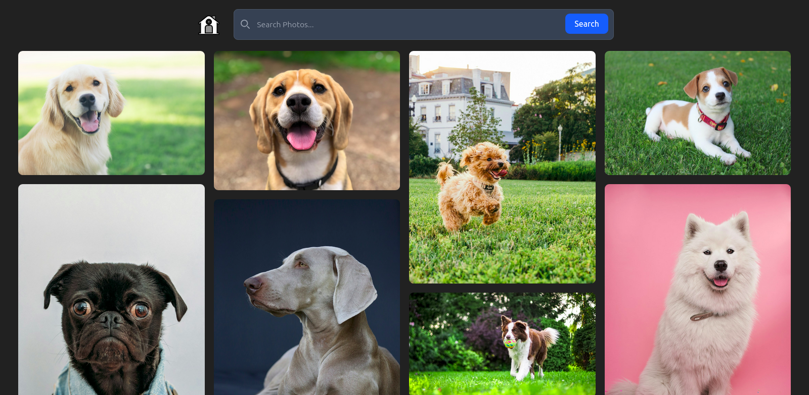

# 🔍 ImageFinder

**ImageFinder** is a modern image search web application built with **React + Redux Toolkit**.
It allows users to search and explore high-quality images using an external API.

---

## 🚀 Features

* 🔍 Search images instantly
* 🏠 Beautiful Hero/Home section
* ⚡ Fast state management with Redux Toolkit
* ⏳ Loading state handling
* ❌ Error handling for failed API requests
* 📱 Responsive design (mobile + desktop)

---
## 📸 Preview

### 🏠 Home Screen


### 🔍 Search Results


---

## 🛠️ Tech Stack

* React
* Redux Toolkit
* JavaScript (ES6+)
* Tailwind CSS
* Vite

---

## 📂 Project Structure

```bash
src/
 ├── components/
 ├── features/
 ├── api/
 ├── redux/
 ├── assets/
```

---

## ⚙️ Environment Variables

Create a `.env` file in the root directory and add:

```env
VITE_API_KEY=your_api_key_here
```

---

## ▶️ Run Locally

```bash
git clone https://github.com/prasanta-dev/image-finder.git
cd image-finder
npm install
npm run dev
```

---

## 🌐 API Used

* Unsplash API

---

## 📌 Future Improvements

* Infinite scrolling
* Skeleton loading UI
* Debounced search
* Save favorite images

---

## 👨‍💻 Author

**Prasanta Debnath**
